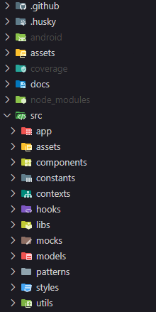

<p align="center">
  
  <hr>
  <h1 align="center">Dinamiques: conhecimento ao alcance de todos</h1>
</p>

<p align="center">
  
  <a aria-label="Last Commit" href="https://github.com/FelipeCourse/dinamiques-mobile-expo/commits/main">
    
  </a>
  <!--  -->
  
</p>

<br>

<p align="center">
  <a target="_blank" href="https://docs.github.com/pt/actions">
    
  </a>
  <a target="_blank" href="https://commitlint.js.org/">
    
  </a>
  <a target="_blank" href="https://github.com/lint-staged/lint-staged">
    
  </a>
  <a target="_blank" href="https://typicode.github.io/husky/">
    
  </a>
</p>
<p align="center">
  <a target="_blank" href="https://expo.dev/">
    
  </a>
  <a target="_blank" href="https://reactnative.dev/">
    
  </a>
  <a target="_blank" href="https://www.typescriptlang.org/">
    
  </a>
    <a target="_blank" href="https://axios-http.com/ptbr/docs/intro">
    
  </a>
  <a target="_blank" href="https://react-hook-form.com/">
    
  </a>
  <a target="_blank" href="https://www.npmjs.com/package/react-native-markdown-display">
    
  </a>
  <a target="_blank" href="https://www.npmjs.com/package/reanimated-color-picker">
    
  </a>
  <a target="_blank" href="https://date-fns.org/">
    
  </a>
  <a target="_blank" href="https://zod.dev/">
    
  </a>
  <a target="_blank" href="https://heroicons.com/">
    
  </a>
  <a target="_blank" href="https://www.npmjs.com/package/expo-jwt">
    
  </a>
  <a target="_blank" href="https://eslint.org/">
    
  </a>
  <a target="_blank" href="https://prettier.io/">
    
  </a>
</p>

## Índice

<ol>
  <li><a href="#sobre">Sobre</a></li>
  <li><a href="#funcionalidades">Funcionalidades</a></li>
  <li><a href="#arquitetura">Arquitetura</a></li>
  <li><a href="#cicd">CI/CD</a></li>
  <li><a href="#como-executar">Como executar</a></li>
  <li><a href="#tecnologias">Tecnologias</a></li>
  <li><a href="#autor">Autor</a></li>
</ol>

## Sobre

Aplicativo do blog desenvolvido em React Native com Expo, no qual docentes gerenciam alguns recursos através de uma área administrativa restrita e os alunos visualizam os artigos publicados.

## Funcionalidades

> **IMPORTANTE !**
>
> - Os itens abaixo sem a marcação de checado são recursos que estão mapeados para serem implementados posteriormente.

- [x] **Usuário poderá se autenticar quando estiver com o status ativo**

- [ ] **Usuário autenticado como administrador poderá gerenciar:**

  > Todas as funcionalidades abaixo estão implementadas na API e serão integradas futuramente na interface.

  - **Usuários**
    - [ ] Criar
      - [ ] Com restrição de `email` e `username` únicos
    - [ ] Consultar todos
      - [ ] Com paginação e limite de itens
      - [ ] Ordenar por padrão em ordem decrescente de criação
      - [ ] Ordenar por nome, ativo e criado em
    - [ ] Filtrar por nome
    - [ ] Editar
      - [ ] Visualizar detalhes
      - [ ] Com restrição de `email` e `username` únicos
    - [ ] Deletar
      - [ ] Do tipo `soft delete` para se manter histórico
      - [ ] Não é possível deletar ( desativar ) um usuário já desativado
  - **Docentes**
    - [ ] Criar
      - [ ] Com restrição de `nome` único
    - [ ] Consultar todos
      - [ ] Com paginação e limite de itens
      - [ ] Ordenar por padrão em ordem decrescente de criação
      - [ ] Ordenar por nome, ativo e criado em
    - [ ] Filtrar por nome
    - [ ] Editar
      - [ ] Visualizar detalhes
      - [ ] Com restrição de `nome` único
      - [ ] Se `isActive` for alterado, o mesmo se replica ao usuário correspondente
    - [ ] Deletar
      - [ ] Do tipo `soft delete` para se manter histórico
      - [ ] Não é possível deletar ( desativar ) um docente já desativado
      - [ ] É feita automaticamente a desativação do seu usuário correspondente

- [x] **Usuário autenticado como docente poderá gerenciar:**

  - **Docentes**
    - [x] Criar
      - [x] Com restrição de `nome` único
    - [x] Consultar todos
      - [x] Com paginação e limite de itens
      - [x] Ordenar por padrão em ordem decrescente de criação
      - [ ] Ordenar por nome, ativo e criado em
    - [ ] Filtrar por nome
    - [x] Editar
      - [x] Visualizar detalhes
      - [x] Com restrição de `nome` único
      - [ ] Se `isActive` for alterado, o mesmo se replica ao usuário correspondente
    - [x] Deletar
      - [x] Do tipo `soft delete` para se manter histórico
      - [x] Não é possível deletar ( desativar ) um usuário já desativado
      - [x] É feita automaticamente a desativação do seu usuário correspondente
  - **Alunos**
    - [x] Criar
      - [x] Com restrição de `nome` único
    - [x] Consultar todos
      - [x] Com paginação e limite de itens
      - [x] Ordenar por padrão em ordem decrescente de criação
      - [ ] Ordenar por nome, ativo e criado em
    - [ ] Filtrar por nome
    - [x] Editar
      - [x] Visualizar detalhes
      - [x] Com restrição de `nome` único
      - [ ] Se `isActive` for alterado, o mesmo se replica ao usuário correspondente
    - [x] Deletar
      - [x] Do tipo `soft delete` para se manter histórico
      - [x] Não é possível deletar ( desativar ) um usuário já desativado
      - [x] É feita automaticamente a desativação do seu usuário correspondente
  - **Categorias**
    - [x] Criar
      - [x] Com restrição de `nome` único
    - [x] Consultar todas
      - [x] Com paginação e limite de itens
      - [x] Ordenar por padrão em ordem decrescente de criação
      - [ ] Ordenar por nome, ativo e criado em
    - [ ] Filtrar por nome
    - [x] Editar
      - [x] Visualizar detalhes
      - [x] Com restrição de `nome` único
    - [x] Deletar
      - [x] Com restrição de somente se não estiver associada em artigo(s)
  - **Artigos**
    - [x] Criar
      - [x] Com restrição de `título` e `slug` únicos
      - [ ] Adicionar editor de texto rico e preview do conteúdo
    - [x] Consultar todos
      - [x] Com paginação e limite de itens
      - [x] Ordenar por padrão em ordem decrescente de data da última publicação
      - [ ] Ordernar por categoria, docente, título, data da última publicação, publicado e criado em
    - [ ] Filtrar por título
    - [x] Editar
      - [x] Visualizar detalhes do artigo concatenando com dados do docente e categoria
      - [x] Com restrição de `título` e `slug` únicos
    - [x] Deletar

- [x] **Usuário autenticado como aluno poderá acessar:**

  - **Tela inicial do blog**
    - [x] Consultar artigos
      - [ ] Com paginação e limite de itens
      - [ ] Favoritar artigo para leitura
    - [x] Filtrar artigos por categoria ativa
    - [x] Filtrar artigos por título ou conteúdo na barra de pesquisa
  - **Tela de detalhes do artigo**
    - [x] Visualizar detalhes
    - [x] Visualizar e acessar artigos ativos recomendados de mesma categoria
    - [ ] Compartilhar artigo nas principais redes sociais
    - [ ] Publicar um comentário no artigo

- [x] **Usuário não autenticado poderá se registrar como aluno**

## Arquitetura

O projeto foi desenvolvido seguindo diversas boas práticas e princípios arquiteturais para que se mantenha robusto e escalável para novas implementações. Futuramente poderá ser ainda mais aprimorado e aplicado DDD como foi feito na API.

- Clean code
- DRY ( Dont Repeat Yourself )

A estrutura de pastas é semântica e os arquivos estão devidamente categorizados de acordo com suas finalidades.



## CI/CD

Embora esteja sendo utilizado o `husky` com o `lintstaged` para já validar o arquivo tanto em sua estrutura de código, quanto na validação dos testes após cada `push`. Há ainda um `workflow` configurado com o `github actions` responsável por efetuar os fluxos abaixo, assim como executar os devidos `scripts` definidos em `package.json` com o sufixo `ci`. Embora temporariamente não há testes implementados.

- **Integração contínua**
  - Validação de testes **unitários** a cada `push` e em qualquer `branch`
  - Validação de testes de **integração** e de **e2e** em cada `pull request` **( Em breve )**
- **Entrega contínua ( Em breve )**
  - Após ser efetuado um `push` na `branch main` e já ter sido executado todo o fluxo de integração contínua, será feito o `build` prévio da aplicação e disponibilizada a imagem no `dockerhub`.

> **DICA !**
>
> Para mais detalhes das configurações feitas, pode-se acessar os arquivos na pasta [workflows](./.github/workflows/).

## Como executar

### Testes

Não foram implementados testes nesse momento, porém já há uma configuração definida para que seja feita posteriormente.

#### Pré-requisitos

Instalar as dependências do projeto.

```bash
pnpm install
```

#### Unitários

```bash
pnpm run test
```

#### Cobertura

Será gerado um relatório no terminal, assim como um arquivo `index.html` dentro da pasta `./coverage/index.html` que poderá ser aberto para uma visão mais ampla.

```bash
pnpm run test:coverage
```

### Linters

A execução dos `linters` podem ser aplicados automaticamente dependendo da configuração do seu editor de código, ao salvar um arquivo, por exemplo, no `VSCODE`.
Mas se caso desejar executar via comando poderá executar os seguintes:

#### Eslint

```bash
pnpm run lint:fix
```

#### Prettier

```bash
pnpm run prettier:format
```

### Localmente

#### Pré-requisitos

- Instalar as dependências do projeto.
- A API e o banco de dados devem estar em execução.

```bash
pnpm install
```

Configure previamente as variáveis de ambiente criando um arquivo `.env` na raiz do projeto. É possível obter o nome das variáveis a serem definidas, no arquivo `.env.example` contida na pasta raiz do projeto.

```bash
# Informe um termo para o secret do token da API
EXPO_PUBLIC_JWT_SECRET=

# Informe a url da API, normalmente será o endereço IP
EXPO_PUBLIC_DINAMIQUES_API=

# Informe um nome da chave para armazenar informações de autenticação
EXPO_PUBLIC_STORAGE_KEY=
```

A API e o banco de dados estando em execução, basta executar o comando abaixo e selecionar o formato de execução desejado que o expo oferece:

```bash
pnpm start
```

Caso não conseguir executar por problemas de o dispositivo não estiver na mesma rede ( mesmo estando ) ou outro similar, uma forma é executar via navegador e para isso basta executar:

```bash
npx expo start --lan
```

Abrir o endereço fornecido no navegador, ex: `http://111.22.33.444:8080`. A API também deverá ser executada localmente e sem utilizar o docker.

#### Autenticação com usuário padrão

Como a rota de criação de usuário é protegida com autenticação, foi criado um usuário padrão para que seja possível se autenticar e acessar demais recursos. Segue abaixo os dados do usuário para autenticação inicial.

```json
{
  "email": "leticia.pereira@dinamiques.com.br",
  "password": "admin"
}
```

## Tecnologias

- [CI/CD: GitHubActions](https://docs.github.com/pt/actions)
- [Expo](https://expo.dev/)
- [ReactNative](https://reactnative.dev/)
- [ReactHookForm](https://react-hook-form.com/)
- [ReactNativeMarkdownDisplay](https://www.npmjs.com/package/react-native-markdown-display)
- [ReanimatedColorPicker](https://www.npmjs.com/package/reanimated-color-picker)
- [Typescript](https://www.typescriptlang.org/)
- [Axios](https://axios-http.com/ptbr/docs/intro)
- [ExpoJWT](https://www.npmjs.com/package/expo-jwt)
- [ESLint](https://eslint.org/)
- [Prettier](https://prettier.io/)
- [CommitLint](https://commitlint.js.org/)
- [LintStaged](https://github.com/lint-staged/lint-staged)
- [Husky](https://typicode.github.io/husky/)
- [DateFns](https://date-fns.org/)
- [Zod](https://zod.dev/)
- [Heroicons](https://heroicons.com/)

> **DICA !**
>
> Todas as demais dependências utilizadas podem ser visualizados acessando o [package.json](./package.json).

## Autor

<table>
  <tr>
    <td align="center">
      <a href="https://github.com/FelipeCourse">
        
        <br />
        <sub>
          <b>Felipe DR</b>
        </sub>
      </a>
      <br />
      <a href="mailto:felipe.corp7@gmail.com" title="E-mail">📩</a>
    </td>
  </tr>
</table>
